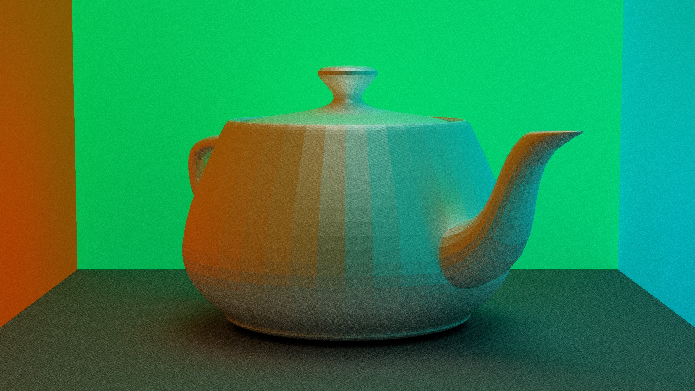

# Rust Basic Path Tracer

This program is a basic path tracer written in Rust.
You can visualize spheres, planes, and triangles (thus, meshes) in desired lighting conditions.
Almost everything (vectors, colors, images...) is home made, as this prpject was focused on learning Rust.
It is right now not very fast, but improvement is on its way!





## How to use

### Installation

You can either install the program manually and use it localy, or install it globaly.

#### Build manually

```
# Clone the repository
git clone https://github.com/timothee-faget/rust-basic-path-tracer.git
cd rust-basic-path-tracer

# Build the project (use --release for optimized build)
cargo build --release

# Run
./target/release/Budget_Tracker scene_file.rtp image_file.ppm
```

#### Install globaly with cargo

```
# Clone the repository
git clone https://github.com/timothee-faget/rust-basic-path-tracer.git
cd rust-basic-path-tracer

# Install the binary to Cargo's bin directory
cargo install --path .

# Run
rust-basic-path-tracer scene_file.rtp image_file.ppm
```

### Run the path tracer

To create an image, you need to give the program 2 arguments:
 - scene_file : the .rtp file describing the scene 
 - image_file : the .ppm file to save the image to

```
rust-basic-path-tracer scene_file.rtp image_file.ppm
```

#### Resolution

By default, the image rendered is 1280 by 720 pixels. To change that, you can either chose from one of the followings, or enter a specific resolution.

- H : 3840 x 2160 pixels
- h : 1920 x 1080 pixels
- m : 1280 x 720 pixels
- l : 720 x 480 pixels
- L : 360 x 240 pixels

Use the --resolution or -r argument.

```
rust-basic-path-tracer scene_file.rtp image_file.ppm -r H
rust-basic-path-tracer scene_file.rtp image_file.ppm -r l
rust-basic-path-tracer scene_file.rtp image_file.ppm -r 400 300
```

#### Resolution

By default, the image rendered with 50 iterations and rays can bounce up to 13 times. To change that, you can either chose from one of the followings, enter a specific value for iterations, of for iterations and max bounces.

- H : 300 iterations, 40 max bounces
- h : 150 iterations, 30 max bounces
- m : 50 iterations, 13 max bounces
- l : 20 iterations, 8 max bounces
- L : 5 iterations, 5 max bounces

If only a iterations value is specified, max bounces will be set as the min between iterations and 20.

Use the --quality or -q argument.

```
rust-basic-path-tracer scene_file.rtp image_file.ppm -q H
rust-basic-path-tracer scene_file.rtp image_file.ppm -q l
rust-basic-path-tracer scene_file.rtp image_file.ppm -q 40
rust-basic-path-tracer scene_file.rtp image_file.ppm -q 40 10
```

### Examples

Some basic examples can be run, found in [examples](examples/).

```
cargo run --example demo
```

### RTP file

This is the file format used to describe the scene.

It contains, in this order :

#### Camera

```
camera {
    position: 0.0 3.0 15.0
    rotation: 0.0 0.0 1.0 -0.05 
    focal_length: 5.0
    fov: 30.0
}
```

#### Materials

```
material {
  name: mat_example
  color: 1.0 0.3 0.0
  emission_color: 1.0 0.3 0.0
  specular_color: 0.2 0.2 0.2
  emission_strength: 0.3
  smoothness: 0.2
  specular_prob: 0.2
}
```

#### Objects

##### Meshes 

```
mesh {
    position: 0.0 0.0 0.0
    rotation: 0.9 0.0 -0.38 0.0
    obj_file: obj/teapot.obj
    mat: mat_example 
}
```

##### Spheres 

```
sphere {
    position: 0.0 0.0 0.0
    radius: 2.0
    mat: mat_example
}
```

#### Planes 

```
plane {
    point: 0.0 0.0 0.0
    normal: 0.0 1.0 0.0
    mat: mat_example
}
```

#### Triangles 

```
triangle {
    point_1: 0.0 0.0 0.0
    point_2: 0.0 1.0 0.0
    point_3: 0.0 0.0 1.0
    mat: mat_example
}
```

#### Cubes

```
cube {
    position: 0.0 0.0 0.0
    rotation: 1.0 0.0 0.0 0.0
    size: 15.0
    mat: mat_example
}
```

## Know problems

- Overall performance: the Tracercer is not fast. At all. I need to improve that
- Random number generation: the LCG used is a little bit periodic.


